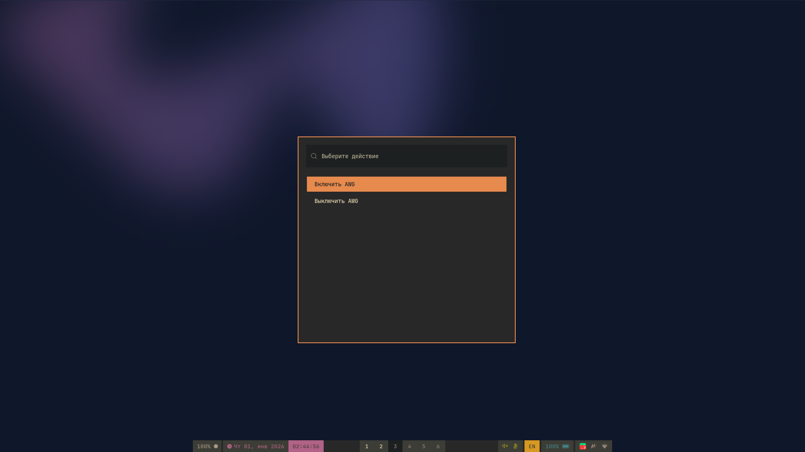

# AWG-wofi
Набор скриптов для удобной работы с [`AmneziaWG`](https://github.com/amnezia-vpn/amneziawg-go) с помощью [`wofi`](https://github.com/SimplyCEO/wofi) в [`Arch Linux`](https://archlinux.org)

## Установка зависимостей
```shell
sudo pacman -S git wofi polkit python bash libnotify python-pip systemd-resolvconf
sudo systemctl enable --now systemd-resolvconf.service
sudo systemctl enable --now polkit.service
```


## Установка AmneziaWG 
Если вы используете стандартное ядро или ядро от CachyOS то можно воспользоваться AUR 
```shell
git clone https://aur.archlinux.org/yay.git && cd yay
makepkg -si

yay -S amneziawg-tools amneziawg-dkms
```
Если вы используете **не**стандартное ядро типо lts, zen то вам [сюда](https://github.com/ritascarlet/Anti-RKN-on-any-linux-distributions)

## Клонирование репозитория
```shell
git clone https://github.com/Flat447/AWG-wofi.git
cd AWG-wofi
python install.py
```
После этого можно использовать команду `wofi-vpn` либо запускать из любого лаунчера приложений скрипт AWG
